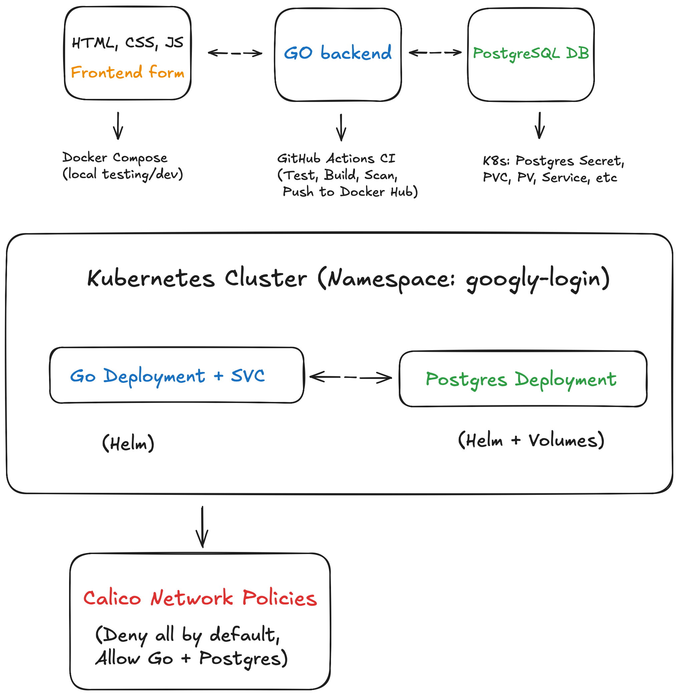
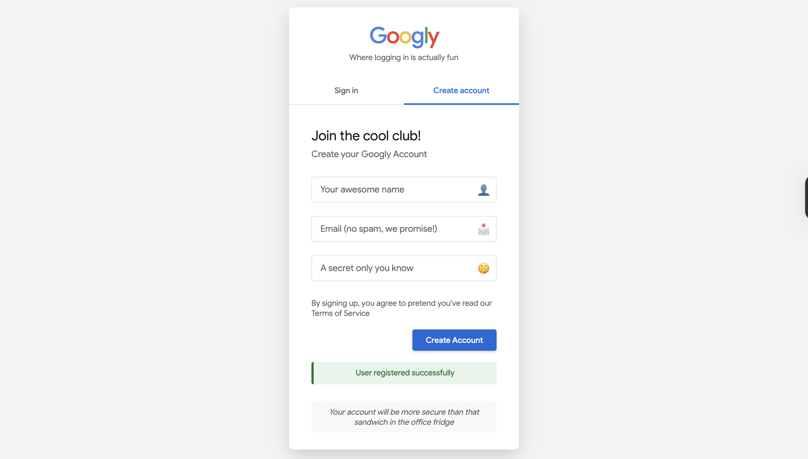
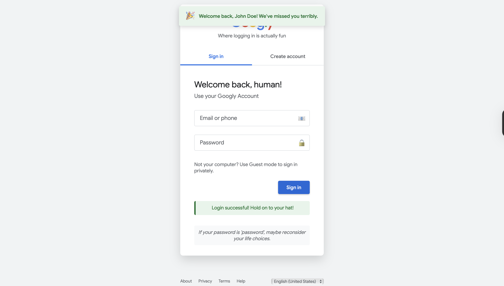

# Googly Login – Sarcastic Login Page with Secure K8s Stack ☸️🔐

Googly Login is a fun registration system built with Go, PostgreSQL, Docker, and Kubernetes. It features a sarcastic front-end, secure backend logic, Helm-based deployment, Calico network policies, and CI/CD automation using GitHub Actions.

---

## 📑 Table of Contents

- [Features](#features)
- [Tech Stack](#tech-stack)
- [Project Structure](#project-structure)
- [Architecture](#architecture)
- [Screenshots](#screenshots)
- [CI/CD Pipeline](#cicd-pipeline)
- [Local Setup (Docker)](#local-setup-docker)
- [Kubernetes Setup](#kubernetes-setup)
- [Helm Setup](#helm-setup)
- [Network Policies with Calico](#network-policies-with-calico)
- [Secrets Management](#secrets-management)
- [Demo](#demo)
- [Author](#author)

---

## ✨ Features

- 🧠 Sarcastic login/registration form with basic HTML/CSS/JS
- 🔐 Secure user authentication with password hashing
- 📦 Dockerized Go backend and PostgreSQL DB
- 🚀 CI/CD with GitHub Actions (test → build → push)
- ☸️ Kubernetes deployment using Helm
- 🧱 Persistent PostgreSQL storage via PVC
- 🔒 Calico network policies (deny all → allow only necessary traffic)
- 📁 Secrets stored securely — never committed to GitHub

---

## 🧰 Tech Stack

| Layer         | Tool / Technology     |
|---------------|------------------------|
| Frontend      | HTML, CSS, JavaScript  |
| Backend       | Go                     |
| Database      | PostgreSQL             |
| Container     | Docker                 |
| Deployment    | Kubernetes + Helm      |
| CI/CD         | GitHub Actions         |
| Security      | Calico (NetworkPolicy) |
| Secrets Mgmt  | K8s Secret + `.env`    |

---

## 🗂️ Project Structure

```plaintext
Googly-Login/
├── database/                         # DB connection logic
│   └── database.go
├── googly-data/                      # (generated data folder)
├── googly-login/                     # (helm module folder)
├── handlers/                         # Auth and routing handlers
│   ├── auth.go
│   └── routes.go
├── HelmCharts/                       # Helm chart for K8s deployment
│   ├── Chart.yaml
│   ├── values.yaml
│   └── templates/
│       ├── googly-deployment.yaml
│       ├── googly-service.yaml
│       ├── postgres-deployment.yaml
│       ├── postgres-pv.yaml
│       ├── postgres-pvc.yaml
│       ├── postgres-secret.yaml      # secret file (ignored from Git)
│       └── postgres-service.yaml
├── models/                           # Go struct models
│   └── user.go
├── static/                           # Static frontend files (HTML/CSS/JS)
│   ├── index.html
│   ├── styles.css
│   ├── script.js
├── utils/                            # Utility-password hash logic
│   └── password.go
├── .github/                          # GitHub Actions workflows
│   └── workflows/
│       └── cicd.yaml
├── .env                              # Local env file (ignored from Git)
├── .gitignore                        # Ignore sensitive/unneeded files
├── calico-network-policies.yaml     # Network policy rules using Calico
├── docker-compose.yaml              # Local dev stack with Go + Postgres
├── Dockerfile                        # Builds the Go backend image
├── go.mod                            # Go module definitions
├── main.go                           # Main application entrypoint
├── main_test.go                      # Unit tests for main
└── README.md
```


> 📝 Note: `.env` and secrets are intentionally excluded from the repo for security reasons.

---

## 🏗️ Architecture



---

## 📸 Screenshots

  


---

## ⚙️ CI/CD Pipeline

- GitHub Actions runs on `push` or `PR`:

  - ✅ Lint & test Go code
  - 🐳 Build Docker image
  - 🚢 Push to DockerHub
    
- Example: `.github/workflows/cicd.yaml`

---

## 💻 Local Setup (Docker)

```bash
# Clone the repo
git clone https://github.com/nsahil992/googly-login
cd googly-login

# Copy .env.example and set values (never commit .env!)
cp .env.example .env

# Start app
docker compose up --build

```

---

## ☸️ Kubernetes Setup

```
# Apply Postgres manifests first
kubectl apply -f postgres-pvc.yaml -f postgres-secret.yaml -f postgres-service.yaml -f postgres-deployment.yaml -f postgres-pv.yaml -n googly-login

# Apply Googly manifests
kubectl apply -f googly-deployment.yaml -f googly-service.yaml -n googly-login

```

---

## ⛵ Helm Setup

```
# Install all components via Helm chart
helm install googly-login ./helm/ -n googly-login

```

---

## 🧱 Network Policies with Calico

```
kubectl apply -f calico-network-policy.yaml -n googly-login

```

---

## 🔐 Secrets Management


✅ .env is used for local development only and is never committed to GitHub
✅ Kubernetes Secrets are defined in postgres-secret.yaml (base64-encoded)
🔒 You must create secrets locally 

---

## 📽️ Demo

[](https://youtu.be/abcd1234xyz)

> 🔗 Click the image above to watch a 5-minute walkthrough of Googly Login in action.

---

## 👤 Author

Made with 💻 and ☕ by **Sahil**

- [GitHub](https://github.com/nsahil992)
- [LinkedIn](https://linkedin.com/in/nsahil992)

---

⭐ Don’t forget to star this repo if it helped you learn something new!

